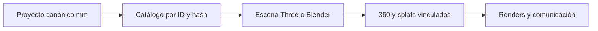

# Auditoría de integración del ecosistema Rubik Sota / Immersphere

Fecha de consulta: **30-09-2026**. Auditoría documental y de código; no implementación ni prueba de los servicios publicados. Base de Rubik Sota: `19d286b5d8d1b288048ee5617ea734cff2964ef6` (`master`). Las referencias externas fijan el SHA inspeccionado, no un estado futuro de las ramas.

## Conclusión y grado de certeza

Hay piezas reutilizables para conectar **plano → geometría editable → mobiliario → presentación inmobiliaria**, pero la cadena completa todavía no está demostrada. La oportunidad comercial es una hipótesis: reutilizar una propuesta amueblada en anuncios, tours y ofertas. No se ha elegido cliente prioritario; **D-01 sigue pendiente**.

1. **Rubik Sota conserva la fuente de verdad geométrica:** FloorPlanProjectV1, schema 1.3.0, coordenadas en milímetros, muros, habitaciones, huecos y objetos editables. Su calibración no certifica medidas profesionales. Renders, splats, panoramas y vídeos deben ser derivados vinculados, no sustitutos del proyecto [R1].
2. **Asset Lab contiene modelos reales, pero su Room Designer es 2.5D:** compone imágenes de producto con posiciones relativas, escala visual y orden de capas. Ese resultado no es una escena medida reutilizable automáticamente por Rubik Sota [A1], [A2].
3. **La conexión Room Designer → CRM falla actualmente en el contrato:** el exportador comercial produce `lineItems`; el importador exige `products`. Se reprodujo el rechazo ejecutando las funciones reales aisladas con datos sintéticos. La documentación del flujo no equivale a interoperabilidad [A2], [C1].
4. **Immersphere Pro SaaS tiene código de visores 360, GLB, PLY y Gaussian, hotspots y publicación**, además de procesamiento de briefs mediante un proveedor LLM. No se encontró captura LiDAR nativa ni reconstrucción métrica automatizada. Parte de los visores de captura está marcada experimental; las webs no pudieron abrirse desde este navegador [S1], [S2], [S3], [S4].
5. **El laboratorio Astra quedó localizado tras el enlace de Juanma:** `lab-astra-sept-2026`. Documenta la orquestación y apunta a `blender-mcp` en `lab/astra-sept-2026`, una rama técnica distinta del `main` genérico auditado inicialmente. Hay código de Safe Mode/captura, pero no una ejecución completa del benchmark demostrada en los árboles consultados. **Seedance 2.5 sigue sin evidencia de integración** [L1], [L2], [B4].

F1a/F1b están integradas; F2 sigue experimental, con **cinco sesiones y veinte planos pendientes**, sin bloquear F3. F3 inicial está integrada; **catálogo externo pendiente**. Esta propuesta no cierra fases ni amplía su alcance [R2].

## Repositorios y acceso

Los nueve repositorios identificados fueron legibles mediante Git; Blender MCP se inspeccionó en dos ramas distintas. La API de GitHub y la navegación web tienen bloqueos distintos; no se confunden con falta de acceso al código. Los ocho repos externos se consultaron en `main`; además se leyó la rama técnica `lab/astra-sept-2026` de Blender MCP.

| Repositorio / URL | Papel y funciones encontradas | SHA exacto inspeccionado | Acceso y límite |
| --- | --- | --- | --- |
| [floorplan-3d](https://github.com/Juanmaes83/floorplan-3d) | Editor local, proyecto canónico, F2 experimental, F3 inicial | `19d286b5d8d1b288048ee5617ea734cff2964ef6` | Checkout y Git; no suites históricas repetidas |
| [immersphere-pro](https://github.com/Juanmaes83/immersphere-pro) | SaaS multi-tenant: propiedades, espacios, medios, tours, hotspots y captura | `560b65389e67f46dc4fc584179b63e9fb5c743d0` | Git; web bloqueada en Playwright |
| [immersphere-pro-crm-leads](https://github.com/Juanmaes83/immersphere-pro-crm-leads) | CRM HTML/localStorage y backend de automatización separado | `6173ae6dc64621cf310734dd19947d3a54257ea9` | Git; Pages bloqueada; importer aislado ejecutado |
| [IMMERSPHERE-PRO-INMOBILIARIAS](https://github.com/Juanmaes83/IMMERSPHERE-PRO-INMOBILIARIAS) | Web comercial, producción visual, Visual Lab / Decor Asset Lab | `4c01c61edd657d0f356927fa27f9fea7544dab4d` | Git; web bloqueada; 360 mostrado como mockup en código |
| [immersphere-asset-lab](https://github.com/Juanmaes83/immersphere-asset-lab) | **Cuarta pieza**, catálogo, visor, Scene Composer y Room Designer | `5dc7b182c5c227472b84aea66a3ffa1368c95981` | Git; inventario y decodificación rehechos; web bloqueada |
| [INMOBILIARIA-PREMIUM_IMMERSPHERE-](https://github.com/Juanmaes83/INMOBILIARIA-PREMIUM_IMMERSPHERE-) | Presentación inmobiliaria específica, imágenes y slots de vídeo | `358a6b6f16a3fd9fb56e8da8e737782fc2442974` | Git; Pages bloqueada; distinta de la web comercial principal |
| [IKEA-3d-model-batch-downloader](https://github.com/Juanmaes83/IKEA-3d-model-batch-downloader) | Obtención de GLB mediante Selenium, registro SQLite | `3a036f1820c44b470aded71e651a1e791fd5d022` | Git; script leído, no ejecutado |
| [blender-mcp](https://github.com/Juanmaes83/blender-mcp) | Addon/socket Blender, MCP/Claude, ejecución Python e importación | `61fb53ebd55e1940bb94d611684f310e88d9dea9` | Git; snapshot genérico, distinto de la rama LAB indicada más abajo |
| [lab-astra-sept-2026](https://github.com/Juanmaes83/lab-astra-sept-2026) | LAB de orquestación espacial, manifiestos propuestos, Blender y QA | `245de0184f7c7ecd5a7d4ceffba43dee1945a75a` | Git; once Markdown y `.gitignore`, sin código ejecutable/escenas/outputs |
| [blender-mcp — rama LAB](https://github.com/Juanmaes83/blender-mcp/tree/lab/astra-sept-2026) | Fuente técnica referenciada: MCP 1.9.1, Safe Mode, captura y tests | `26c8861e2df96dbc7444dbd8f7ab932fae8217ae` | Git; código leído, no conexión Blender ejecutada |
| Seedance 2.5 | Generación de vídeo comunicada por Juanma | **No identificada en estas fuentes** | Sin código/configuración/referencia que demuestre integración |

Los tres proyectos de Immersphere son SaaS, CRM y web comercial. Asset Lab y Premium se registran aparte. Se buscó en referencias cruzadas, perfil público y consultas de repositorios por Immersphere, IKEA, Astra, Blender y Seedance. La coincidencia pública «Astra» `wright-flyer`, SHA `671b5d80645a33aac424e3609c57490795361561`, describe un juego de vuelo; se excluyó. Una búsqueda pública no enumera todos los repos privados.

La consulta inicial al nombre supuesto `immersphere-pro-saas` devolvió `Repository not found`; luego se leyó el nombre correcto aportado por Juanma, `immersphere-pro`. Ese primer intento no prueba que falte el SaaS. No quedó inaccesible por Git ninguno de los repos identificados por Juanma. El enlace posterior del LAB resolvió su identificación; la conclusión inicial de «Astra no identificado» queda sustituida por esta ampliación. No convierte los objetivos de su roadmap en capacidades ejecutadas.

Antecedente competitivo: [matriz publicada en su rama, SHA b97e71a64a76a1b7f79c8f6cc0ca2886533e27a5](https://github.com/Juanmaes83/floorplan-3d/blob/b97e71a64a76a1b7f79c8f6cc0ca2886533e27a5/docs/product/competitive-opportunity-matrix.md). Se conservó esa rama y no se copió ni fusionó su contenido. La lista pública de PR mostró #1, #2 y #3 abiertas; no mostró una PR de esa matriz. La API no permitió una enumeración autenticada completa. Las capacidades de competidores mencionadas por Juanma orientan la visión, pero no se probaron ni se volvieron a investigar en esta auditoría.

## Inventario de capacidades y significado de las etiquetas

**Implementado y comprobado** exige una comprobación ejecutada, acotada y descrita aquí. **Prototipo** identifica código experimental/demo; **documentado, no ejecutado** incluye código leído cuya ejecución no se comprobó. **Propuesto** indica trabajo futuro. **No verificado** significa evidencia insuficiente. Leer código demuestra que existe una implementación, no que funcione en producción.

| Capacidad | Estado en esta ejecución | Evidencia y límite |
| --- | --- | --- |
| Modelo FloorPlanProjectV1 y edición/importación/exportación | Documentado, no ejecutado aquí | Código y contrato vigentes [R1]; F1 ya integrada [R2], no se repitieron pruebas |
| Raster PNG/JPEG/WebP estático, calibración y trazado manual | Documentado, no ejecutado aquí | F1b y formatos [R3]; no PDF/HEIC ni captura LiDAR propia |
| Detección de candidatos de muros F2 | Prototipo | Asistencia experimental con revisión humana [R2]; sin validación empírica nueva |
| Catálogo F3 local, `assetRef`, GLB y fallback | Documentado, no ejecutado aquí | Loader/catalog y entrega integrada [R4]; banco sintético propio, no catálogo IKEA integrado |
| Existencia, estructura, extensiones y hashes de modelos de Asset Lab | Implementado y comprobado | 134 entradas, 114 GLB físicos, 20 ausentes; lectura binaria actual [A1] |
| Decodificación general GLTFLoader de esos 114 GLB | Implementado y comprobado | 114 decodificados, 0 fallos; harness independiente con Draco, no loader F3 ni prueba de móvil |
| Scene Composer / Room Designer | Prototipo | Imágenes y capas 2.5D [A2]; no muros ni transformaciones físicas |
| Exportador comercial / importer Room Designer del CRM | Implementado y comprobado, **incompatibles** | Rechazo real aislado por `lineItems` frente a `products`; control sintético acepta el gate [A2], [C1] |
| CRM: pipeline, ofertas, propuestas, almacenamiento local | Documentado, no ejecutado | HTML/localStorage [C1]; el backend de automatización existe separadamente [C2] |
| SaaS: entidades, rutas de publicación, panoramas y hotspots | Documentado, no ejecutado | Prisma, visores y rutas [S1], [S2]; servicio publicado no inspeccionado |
| SaaS: Gaussian y PLY nativos para captura | Prototipo | Spark, PLYLoader y flags experimentales [S3]; disponibilidad efectiva de flags no comprobada |
| SaaS: brief/copy/guion de vídeo mediante LLM | Documentado, no ejecutado | Worker y servicio Anthropic [S4]; no genera vídeo, malla ni splat |
| SaaS: LiDAR / Polycam / Luma | Documentado, no ejecutado | Guías de captura externa [S5]; no SDK nativo o ingestor métrico encontrado |
| Web comercial: 360 / Gaussian | Prototipo / propuesto | «Drag simulado» y «Demo360 pendiente asset real»; Gaussian como futuro [W1] |
| Premium: presentación y vídeo | Prototipo | Plantilla y cuatro slots de vídeo [P1]; sin pipeline Seedance demostrado |
| Descargar más GLB de IKEA | Documentado, no ejecutado | Selenium/SQLite; README limita pruebas al sitio finlandés [I1] |
| Blender genérico por MCP | Documentado, no ejecutado | Addon/ejecución Python [B1]; no puente FloorPlanProjectV1 |
| LAB Astra: arquitectura, benchmarks y setup | Documentado, no ejecutado | Repo identificado [L1], [L2], [L3]; manifiestos requeridos, no implementados |
| Blender MCP rama LAB: Safe Mode/captura | Documentado, no ejecutado | Código, validator AST y tests existentes [B4]; no demuestra gates Blender G1–G5 |
| Seedance 2.5 como parte de la cadena | No verificado | Sin menciones/implementación en fuentes nuevas consultadas |
| Geometría → render → panorama → hotspots → vídeo | Propuesto | Arquitectura siguiente; no entrega integrada |

## Captura, geometría, unidades e incertidumbre

Rubik recibe imagen raster y construye geometría mediante calibración y trazado. JSON y ZIP permiten conservar el proyecto y, cuando se solicita, la imagen. El raster no aporta por sí solo profundidad. El contrato mantiene estados de escala `pending`, `estimated` y `real`: la calibración real necesita referencia conocida, segunda cota consistente y confirmación explícita. La tolerancia provisional del 2 % comprueba consistencia, no exactitud certificada [R1], [R3].

El sistema local usa X hacia la derecha e Y hacia abajo, en mm. En el render actual, con centro de geometría `(cx, cy)`: `X=(x-cx)/1000`, `Z=(y-cy)/1000`, `Y=altura/1000`; giro alrededor de Y `−rotationDeg`. El origen de la escena cambia al recalcular el centro: un adaptador debe guardar el centro y la revisión, no inferirlo posteriormente del render [R5].

SaaS acepta fotos, vídeos, panoramas, floorplans, splats externos y documentos como medios de captura. La guía menciona iPhone/iPad LiDAR, Polycam y Luma. Esto no implementa captura ARKit ni convierte puntos en muros. PLY se visualiza como nube de puntos; formatos Gaussian tienen coordenadas de escena sin una escala mm demostrada. `spark_raycast` «high» y `approximate_ray` «low» califican el método de picking, no la precisión física [S3], [S5].

Para relacionar captura con plano se propone registrar procedencia, unidad original, matriz de alineación, puntos de control, residual y limitaciones en un **manifiesto de representación externo**. Harían falta al menos referencias no colineales, orientación del suelo, escala y una longitud independiente de comprobación. El criterio de aceptación métrica aún debe decidirse; no se establece aquí. No importar paredes automáticamente ni promover escala a `real` por usar LiDAR. La edición humana seguiría siendo necesaria.

F3 hoy consume el proyecto vigente y referencias de objetos; no consume escenas SaaS, nubes o tours. Un productor externo tendría que emitir un FloorPlanProjectV1 válido o un adaptador explícito con conversión de unidades, entidades y revisión. Para el catálogo F3 basta recibir un modelo con medidas/procedencia verificables; no requiere implementar captura externa.

## Activos, contratos y permisos

### Inventario actual de Asset Lab

Se volvió a verificar el snapshot `5dc7b182c5c227472b84aea66a3ffa1368c95981`; los números siguientes son de esta ejecución, no una copia del CSV histórico. SHA-256 del manifest: `30d8c7dde47a5b06bf3d03f423bcff3782a37987b37f7ce892bbadea51ddd5ab` [A1].

| Comprobación | Resultado | Consecuencia |
| --- | --- | --- |
| Entradas / modelos físicos versionados / previews existentes | 134 / 114 / 134 | Veinte fichas no acreditan un modelo presente |
| Referencias de permiso existentes | 133; una ausente | Las 133 apuntan a plantilla común, no 133 autorizaciones específicas comprobadas |
| Medidas ancho/alto/fondo completas entre modelos físicos | 1 de 114 | El bbox no sustituye las medidas documentadas del producto |
| GLB con imágenes / Draco requerido / WebP requerido | 113 / 109 / 93 | Contadores solapados; materiales y decoders necesarios |
| GLB sin extensiones declaradas | 5 | Los cinco contienen imágenes: tampoco entran en el loader F3 |
| QA / uso comercial / redistribución en manifest | 134 `pending`; 134 `true`; 134 `false` | No equivalen a QA aprobada ni permiso de hosting público |
| Decodificación independiente GLTFLoader + Draco | 114 correctas, 0 fallos | Compatibilidad con ese harness, no con la aplicación ni rendimiento físico |
| Compatibilidad con política actual de F3 | **0 de 114** | Extensiones o texturas bloquean todos antes de otros filtros |

Se comprobaron cabeceras GLB 2, chunks, referencias URI y hashes. Los modelos no requieren URI externas de buffers/imágenes en los GLB inspeccionados. Decodificar incorporó las transformaciones de nodos al calcular bounds; no acredita dimensiones de fabricante, procedencia ni calidad visual de los 114 modelos. Solo se renderizaron dos muestras en el harness con **SwiftShader, renderizado por software**; no se midió móvil físico.

Candidato técnico para una POC posterior: `ikea-stockholm-2025-puf-alhamn-beige-80586139-demo`, 369.416 bytes, 1.198 triángulos, tres imágenes, sin extensiones declaradas, SHA-256 `f293f011748cb7687beb9e664ca5133eed55beae2c20011453a520c3a1b9f8d0`. Bbox decodificado XYZ: aproximadamente 657,736 × 403,561 × 689,464 mm bajo interpretación métrica. Son bounds de escena, **no medidas físicas verificadas**. Es una selección técnica preliminar, no selección comercial aprobada.

La ficha Vittskar con medidas 640 × 950 × 590 mm da bbox XYZ aproximadamente 612,415 × 945,416 × 657,876 mm. Dos ejes difieren más de 20 mm, el límite actual del loader. No corregir esa diferencia deformando el modelo para hacer pasar QA: verificar orientación, escala, partes incluidas y medición antes [R4].

El README afirma que no contiene GLB reales; el árbol versionado contradice esa frase. También hay propuestas Prisma y hotspots futuros. Para esta auditoría prevalecen los archivos actuales sobre esas declaraciones desactualizadas [A1], [A3].

### Loader F3 y obtención de más modelos

F3 limita GLB a 8 MiB y accessors a 300.000 elementos; comprueba hash del modelo y del permiso, origen/ruta local `assets/f3/`, normalización verificable y diferencia de bounds ≤20 mm. Rechaza imágenes/texturas, cualquier extensión, Draco/WebP, skins, animaciones, morphs, sparse y recursos externos. El catálogo exige QA aprobada y actualmente una marca propia `own-no-third-party-mark`. **No registrar IKEA falsamente como marca propia.** Incorporarlo necesita revisar explícitamente esa política en una entrega de implementación, además del soporte técnico [R4].

El banco sintético local tiene licencia MIT específica para ese recurso, no para modelos IKEA ni para el ecosistema entero. El nombre `immersphere-asset-lab` ya es un valor admitido por `assetRef.catalog`; eso no permite saltarse filtros ni descargar modelos remotos sin revisión [R1], [R4].

El repositorio IKEA es otra pieza: obtiene variantes/URL GLB mediante Selenium y guarda `products(url, name, color, glb_url, downloaded)` en SQLite, con ficheros en `downloaded-files/`. Deduplica URL, no contenido; no produce hashes, dimensiones contrastadas, permisos ni un manifest apto para F3. No se ejecutó, descargó mobiliario ni instaló driver. Sus pruebas declaradas se limitan al sitio de Finlandia [I1]. Ingestión de Asset Lab usa scripts/manuales separados; convertir descargas en catálogo necesita QA y procedencia, no solo copiar una carpeta [A3].

Juanma **ya confirmó autorización general** para los assets de sus repositorios: permite continuar la evaluación y no se pide otra vez. Sigue siendo necesario conciliar por recurso el permiso confirmado con `redistributionAllowed:false`, referencia de plantilla o ausente, atribución, transformación, hosting/streaming, uso comercial y marca. Servir un GLB al navegador entrega el binario; renderizar un PNG no es el mismo uso. La auditoría documental puede publicarse sin copiar assets ni resolver aquí esos usos.

### Formatos reales por componente

| Productor | Entrada / salida comprobadas en código | Unidad e identidad | Condiciones y ejecución |
| --- | --- | --- | --- |
| Rubik | PNG/JPEG/WebP estático; FloorPlanProjectV1 JSON y ZIP; imágenes 2D/3D exportadas | mm; IDs del proyecto/entidades, `assetRef` | Local; imagen original puede revelar dirección/rotulación [R1], [R3] |
| Downloader IKEA | Páginas de producto → GLB + SQLite | URL producto; unidad del GLB no contrastada por script | Adquisición remota; no ejecutada; condiciones de modelos separadas [I1] |
| Asset Lab | Manifest plano JSON, GLB, previews; proyecto `room-designer-lite-2.5d` 0.1.0; lista y resumen comercial | Catálogo `id`/SKU; capas X/Y %, escala visual y orden; no habitación mm | Local/estático; precio ausente queda pendiente, no se inventa [A1], [A2] |
| CRM | JSON Room Designer con `projectName` + `products`; lead/propuesta y localStorage | Lead creado desde timestamp; sin vínculo estable a proyecto/objeto Rubik | Cliente/email/teléfono pueden ser personales; no se importaron datos reales [C1] |
| SaaS | Property/Space/Asset/Hotspot y CaptureJob; JPG/PNG/WebP, GLB, PLY/SPLAT/SOG, embeds; JSON de brief/copy | UUID del SaaS, tenant; posiciones de pantalla %, escenas sin unidad contractual mm | Backend/autenticación/hosting; enum de formatos no prueba todos los loaders [S1], [S4] |
| Blender MCP genérico | JSON socket comandos/parámetros; escena Blender e importación GLTF | Convenciones de la escena y objetos, sin IDs de FloorPlanProjectV1 | Addon local; servicios terceros opcionales; no ejecutado [B1] |
| Web comercial / Premium | HTML, imágenes, vídeos y enlaces de presentación | Sin geometría canónica o IDs cruzados | Publicación separada; plantillas/mockups, no escena editable [W1], [P1] |
| LAB Astra | Propone planos/fotos/geodatos → source/scene/geo manifests → Blender → render/GLB/vídeo | Identidad/transforms/cámaras planteados; sin schema JSON ni adapter Rubik | Documentación de arquitectura, no I/O ejecutado [L1], [L2] |
| Seedance | No verificadas | No verificadas | Sin contrato ni automatización demostrada |

## Inmersión y publicación: capacidades y límites concretos

SaaS distingue propiedad, espacio, asset y hotspot; hay rutas `/property/:id/:slug`, `/embed/:id` y `/capture/:id`. Las acciones incluyen navegación de estancia, información, enlace, imagen/vídeo y CTA como lead/WhatsApp. Son puntos útiles para vincular muebles y alternativas, pero no existe un join nativo con IDs de Rubik [S1], [S2].

El motor 360 coloca una textura en una esfera y maneja yaw/pitch; otros componentes posicionan hotspots como `x/y` porcentuales del viewport. `floorplanPin` también es JSON de posición de plano; no debe confundirse con mm del contrato. Hay que especificar cuál componente consume cada posición. Un hotspot anclado a un objeto exigiría cámara/extrínsecos y proyección, o una posición editorial por vista; reutilizar `%` no garantiza que el enlace siga al mueble al girar [S2].

El visor Gaussian añade incluso un offset visual `(0, −0.65, 0)`; ese ajuste no es calibración física. El PLY es nube, no muros editables. La aceptación de `.ply/.splat/.sog` en tipos no confirma todos los flujos de render [S1], [S3].

`buildPropertyTourZip` genera un ZIP con **solo `tour.html`** y referencias remotas: Pannellum vía jsDelivr o un visor Supersplat embebido; elige un primer asset compatible. Aunque documentación use «offline», no empaqueta todas las habitaciones, medios ni bibliotecas para uso desconectado. No prometer offline completo con ese exportador [S6]. El optimizador GLB del SaaS añade Draco y puede convertir texturas a WebP; su salida no es apta para el loader F3 actual [S7].

El procesador de captura genera estructura de experiencia, hotspots sugeridos, copy, guion, material pendiente y QA con Anthropic. Un guion de vídeo no es un vídeo; este código no ejecuta Seedance ni reconstruye la vivienda [S4]. La web comercial tiene mockups 360 y referencias futuras a Gaussian; Premium es otra plantilla, con imágenes representativas y slots de vídeo. No se deduce un pipeline de producción a partir de vídeos estáticos [W1], [P1].

## Ampliación: LAB Astra localizado y su fuente técnica

Juanma aportó `lab-astra-sept-2026` tras la entrega inicial. Se leyó su árbol completo de documentación en `245de0184f7c7ecd5a7d4ceffba43dee1945a75a` y se verificó por Git la rama técnica que referencia, `blender-mcp/lab/astra-sept-2026`, en `26c8861e2df96dbc7444dbd8f7ab932fae8217ae`. El LAB es un repositorio de experimento/orquestación, **distinto del fork MCP y de los productos Immersphere** [L1], [L3]. No se cambió de rama en Rubik ni se modificaron esas fuentes.

### Qué existe y qué falta

- **LAB:** README, AGENTS, ocho documentos y README de referencias; ningún script ejecutable, schema/manifest JSON real, `.blend`, GLB, render o vídeo en ese árbol. Propone `source_manifest.json`, `scene_manifest.json` y `geo_manifest.json`; el último tiene un ejemplo documental, no un contrato validado [L2], [L3].
- **Entradas previstas:** planos conceptuales, fotos multivista, brief y geodatos abiertos/propios. **Proceso previsto:** estructurar procedencia/escena, agente intercambiable, MCP, Blender, inspección/captura/comparación/corrección. **Salidas previstas:** escena editable, render, walkthrough 10–14 s, GLB y eventualmente Unreal. Son objetivos, no outputs físicos comprobados [L1], [L2].
- **Estado histórico:** `01-CURRENT-STATE.md` está fechado 04-09-2026 y reporta Sol/Codex operativo en Windows del propietario, Astra con errores de acceso y conexión Blender como siguiente gate. No se repitieron inferencias ni se extrapola ese estado de modelos al 30-09-2026 o a este entorno [L1].
- **Fuente técnica LAB:** package MCP 1.9.1, instalación de addon, lectura de escena, captura viewport y ejecución Python; Safe Mode opcional mediante `BLENDER_MCP_SAFE_MODE`. El validator AST se aplica en el servidor MCP antes de enviar código. **No es un sandbox de Blender**: el socket local sigue aceptando ejecución directa y el modo permite operaciones Blender de guardado/importación/render. No se verificó activación, aislamiento o ejecución del addon [B4].
- **Benchmarks y evidencias:** SOLACE propone zona living/dining/kitchen, QA por cámaras y walkthrough; Unreal queda detrás de gates. La rama MCP describe siete imágenes y dos vídeos de referencia con hashes, pero su árbol contiene **solo el README** bajo `references/solace-astra/`: esos nueve binarios no están presentes en el snapshot. Los relatos de auditoría de vídeos son evidencia documental previa, no vídeos inspeccionados aquí ni outputs del LAB [B4], [L2].
- **Seedance/FloorPlanProjectV1:** no se encontraron menciones en el LAB ni en los textos consultados de la rama técnica. No hay adaptador Rubik, invocación Seedance 2.5, API, prompt/export o paso manual documentado que pruebe esa conexión. No se atribuye Seedance al walkthrough Blender por inferencia.

### Puente posible, aún no implementado

Rubik sería productor de JSON canónico mm y referencias autorizadas; LAB sería consumidor mediante un adaptador determinista pendiente hacia `scene_manifest`. Conservar `id`/revisión del proyecto, IDs de habitaciones/objetos, hash/procedencia de modelos y matriz de ejes descrita en esta auditoría. Mantener las restricciones métricas separadas del trabajo del agente en materiales/cámara. Una salida `.blend` podría ser editable, pero solo su QA dimensional acreditaría que conserva las medidas de entrada; un render/vídeo no las acredita.

**Prueba mínima:** un proyecto sintético asimétrico, un hueco y tres objetos; escena/manifest derivados, dimensiones e IDs comprobados, captura antes/después y render desde cámara fija. Si cambia geometría o falla un asset, rechazar la conversión o marcar el sustituto visual sin alterar el proyecto. Puede empezar localmente, sin API pagada, Seedance ni despliegue. Después, un panorama/render aceptado podría entrar como medio y cámara en SaaS con IDs de correspondencia; ese contrato sigue pendiente. Clasificación: **Investigación/POC posterior a F3**, no ampliación de su alcance.

El LAB exige fuentes/licencias/atribución y separa geodatos abiertos/propios de Google Photorealistic 3D Tiles como referencia visual; no se adopta extracción/trazado de esos tiles. Su roadmap geoespacial/Unreal pertenece al LAB, no añade fases a Rubik. No hay licencia global o permiso específico de los benchmarks verificable en ese árbol; la autorización general de Juanma permanece y no se copian materiales [L3].

## Arquitectura propuesta: cinco responsabilidades

Los cinco nodos son responsabilidades, no cinco servicios obligatorios. P conserva geometría/medidas; C resuelve referencias sin insertar binarios; V produce una representación controlada; I añade cámaras, medios y hotspots relacionados; M entrega material visual. Los pasos futuros son opcionales y no modifican P por inferencias de una imagen. La cámara de un render panorámico controlado puede facilitar I; un splat externo necesita calibración adicional.

**Identidad propuesta:** conservar el `id` del proyecto (alias `projectId` en el sidecar), revisión, IDs de habitación/objeto y catálogo/assetId/revisión/hash. Un manifiesto externo registraría relación con UUID Property/Space/Asset/Hotspot, origen de la escena, transformación y revisión de cámara. SKU/nombre no sustituyen `assetId`; un timestamp de lead no sustituye `projectId`. Duplicar proyectos requiere un mapa explícito de nuevas identidades. La revisión del proyecto sería un digest/versionado del JSON exportado, no un campo nuevo ya existente en el schema. Ese manifiesto **no existe aún** y no se añaden campos al schema con `additionalProperties` restringido. La geometría no se serializa de nuevo como «source of truth» en CRM.

**Transformación propuesta Blender:** partiendo del mundo Three actual, `(XB,YB,ZB)=(XThree,−ZThree,YThree)`, en metros, con giro Z `−rotationDeg`; equivalencia directa desde plano `(x−cx, −(y−cy), altura)/1000`. Registrar matriz/centro/revisión y comprobar orientación con una forma asimétrica. El exportador glTF de Blender gestiona cambio de ejes: evitar aplicar la conversión dos veces. Esto es un contrato candidato, no un adaptador implementado ni una normalización universal de los assets.

**Transformación propuesta captura visual:** similitud explícita `p_visual = s·R·p_plano + t`, unidad conocida o estimada, controles y residual independiente. Un render propio puede registrar cámara desde el origen; panorama externo necesita pose y correspondencias; un splat no alineado se mantiene como medio separado. Rechazar espejo, escala incoherente o revisión desfasada y no escribir sus puntos como muros.

### Conexiones y responsabilidades propuestas

| Productor → consumidor | Entrada/salida real y contrato pendiente | Unidad/origen e IDs | Fallo, datos, derechos y lugar |
| --- | --- | --- | --- |
| Asset Lab → Rubik F3 | Manifest/GLB/previews → entrada validada del catálogo; adaptar permisos/QA/materiales [A1], [R4] | Modelo normalizado metros; medida mm trazable; soporte al suelo y centro; `assetRef` + hash | Modelo genérico si falla; no borrar objeto; no PII habitual; permiso de binario/marca específico; primera POC local |
| Room Designer → CRM | Resumen con `lineItems` → `products` requerido [A2], [C1]; contrato comercial controlado pendiente | Cantidades comerciales, posiciones % no convertibles a mm; añadir vínculo externo estable a proyecto/objetos, conservar `assetId` | Rechazo visible; no crear lead parcial; minimizar cliente/email/teléfono; export/import local voluntario; no nube automática |
| Rubik → Blender | JSON medido + GLB autorizados → escena/render; exporter inexistente [R1], [B4], [L2] | Matriz propuesta anterior, proyecto/revisión/room/object IDs en metadatos derivados | Detener si geometría inválida; sustituto visual marcado si falta asset; fotos privadas locales; revisar licencia de cada render/asset; local antes de servicios |
| Blender/render → SaaS | Panorama/GLB/media → Asset/Space/Hotspot existentes [S1], [S2]; manifiesto y endpoint/autorización pendientes | Cámara registrada; enlazar UUID SaaS con IDs Rubik; no transformar hotspots % como puntos 3D | Medio estático si visor falla, sin alterar plano; dirección/fotos interiores/CTA privadas; hosting/atribución; local fixture primero, remoto solo bajo publicación explícita |
| Captura Gaussian/LiDAR → representación vinculada Rubik | PLY/splat/panorama externo → media + sidecar de alineación; no ingestor métrico [S3], [S5] | Unidad por captura, similitud y residual; cámara/asset/room IDs persistentes | Sin calibración: medio separado, no medidas; excluir personas/metadatos sensibles; permisos de captura/hosting; visor local posible, SaaS requiere backend |
| Render/guion → web comercial/Premium/CRM/vídeo | PNG/MP4/enlaces y brief existentes → publicación editorial; LAB propone walkthrough Blender; Seedance sin contrato [W1], [P1], [S4], [L2] | Salida raster/tiempo no medidos; referencia proyecto/revisión/cámara/medio | Sin generador: imágenes y guion manual; no inventar vídeo/medidas; consentimiento inmueble/personas, música/modelos/marca; remoto solo al publicar |

## Oportunidades y secuencia de menor riesgo

El esfuerzo siguiente es preliminar, expresado como trabajo necesario; no se estiman ventas ni días sin una POC. Todas son **propuestas pendientes**, no decisiones aprobadas. Las cinco conexiones recomendadas están ordenadas; las últimas no necesitan ejecutarse para avanzar F3.

| Orden / clasificación | Beneficio potencial y evidencia | Esfuerzo, supuestos y dependencia | Prueba mínima que puede refutarla | Relación con el plan |
| --- | --- | --- | --- | --- |
| 1 — **Investigación/POC:** catálogo Asset Lab → F3 | Amueblar con objetos identificables; existen 114 GLB [A1], ninguno admitido hoy [R4] | Un candidato, permisos/procedencia específicos, medidas contrastadas y soporte de texturas acotado; Draco solo si candidato lo exige; política de marcas correcta | Un GLB con hash fijo y dos orientaciones; comparar dimensiones verificadas y escala; importar/exportar/recargar mantiene `assetRef`; asset corrupto conserva objeto y fallback | Avance F3 externo, sin captura/SaaS/CRM |
| 2 — **Adaptador pequeño:** resumen comercial → CRM | Evitar reescribir mobiliario de una propuesta; incompatibilidad reproducida [A2], [C1] | Traducir una versión de payload y validar cantidades/identidades; supuesto: solo propuesta comercial, sin sincronización bidireccional ni conversión geométrica | Export real sin precios → import: lista/cantidades e identidad conservadas, campos ausentes informados, reimportar no duplica; hoy falla antes del lead | Posterior a F3; requiere elegir flujo CRM, no introducir precios en Rubik |
| 3 — **Investigación/POC:** proyecto → Blender/render | Obtener presentación desde geometría controlada [R1], [R5], [B4], [L2] | Exporter determinista local y escena de prueba; Blender binario disponible, addon no ejecutado; LAB documenta modelo intercambiable, sin acceso Astra probado aquí | Habitación asimétrica, hueco y tres muebles: comprobar longitudes, giro, IDs y revisión antes/después; render sin mover geometría canónica | Posterior; no cambia F3 ni implementa MCP |
| 4 — **Investigación/POC:** render/panorama → SaaS y hotspots | Navegar estancias y relacionar objeto/alternativa/CTA [S1], [S2] | Una propiedad y una cámara con manifiesto externo; controles de tenant/publicación y almacenamiento; no asumir compatibilidad por URL | Fixture local con dos habitaciones/objetos y enlace estable; al cambiar cámara hotspot correcto; medio caído conserva acceso a información; publicación solo bajo prueba autorizada | Posterior, requiere decisión de hosting/privacidad |
| 5 — **Investigación/POC; publicación a posponer:** captura visual alineada | Conectar una vivienda existente con propuesta editable [S3], [S5] | Captura autorizada, unidad/origen/controles, sidecar y revisión humana; no automatizar paredes | Alinear forma asimétrica y comprobar longitud independiente; si residual/orientación no cumplen criterio acordado, dejar media sin medidas | Posterior; criterio métrico y formato LiDAR pendientes |

**Reutilizar ahora:** contrato geométrico, referencias `assetRef`, evidencias de inventario, validator de manifest y fallback existentes; su uso documental/formato se comprobó por lectura y verificaciones descritas. No se afirma reutilización directa de los GLB ni de los servicios privados. Las plantillas pueden orientar una presentación manual con contenido propio, sin considerarlas un editor integrado.

**Posponer:** vídeo generativo por Seedance y ejecución completa del LAB Astra, AR comercial, despliegue SaaS/CRM, colaboración multiusuario y pipeline generativo hasta identificar entradas, costes, derechos, privacidad y demanda. Un primer resultado útil puede ser plano amueblado + render + enlace editorial, sin generación de vídeo.

**Descartar del alcance actual:** convertir un splat en plano certificado por defecto; deducir mm del Room Designer 2.5D; copiar todos los GLB o el stack SaaS; sustituir medidas por resultados generativos; automatizar descargas/publicación. Se descartan de esta entrega, no se pronostica inviabilidad futura.

### F3 que puede avanzar ahora

Preparar una selección técnica muy pequeña y su expediente: recurso físico, SHA, fuente/SKU, permiso específico, dimensiones contrastadas, unidad/ejes/origen, materiales, QA y presupuesto medible. El puf es candidato técnico inicial, condicionado a medidas/procedencia. El banco propio puede seguir siendo control de regresión. La siguiente implementación debe conservar importación/exportación y fallback, decidir cómo admitir marcas externas y soportar texturas bajo límites explícitos. Solo después evaluar Draco y ampliar catálogo.

No añadir SaaS, CRM, LiDAR, imágenes nuevas ni Asset Lab editable a esa entrega por esta propuesta. **Cinco sesiones y veinte planos F2 continúan pendientes**, sin bloquear inventario/POC F3. Medir memoria, tiempos y pérdida de contexto en móvil físico sigue pendiente; los tamaños y triángulos son insumos, no un presupuesto de rendimiento aprobado.

## Producto: necesidad observada frente a hipótesis

| Segmento | Evidencia en los repos | Hipótesis que necesita usuarios |
| --- | --- | --- |
| Agentes / inmobiliarias | Propiedades/tours/CTA SaaS, pipeline CRM y web comercial [S1], [C1], [W1] | Una propuesta amueblada reutilizable mejora preparación de anuncios/visitas; no probado impacto o pago |
| Interioristas / decoradores | Room Designer y propuestas de productos [A2] | Necesitan pasar de composición visual a medidas fiables y alternativas; confirmar uso real de catálogos |
| Reformas / construcción | Muros/huecos/medidas y trazado Rubik [R1], [R3] | El plano editable ayuda a discutir reformas; no sustituye levantamiento técnico, CAD ni presupuesto profesional |
| Empresas de muebles / fabricantes | SKU, marca, catálogo y modelos [A1] | Valoran identificación/alternativas y leads; ninguna asociación comercial demostrada |
| Cliente final | Editor local y render amueblado [R1], [R4] | Quiere comparar colocación y estilo; comprobar confianza en escala, facilidad móvil y privacidad |

Ninguna de esas hipótesis aprueba D-01. Una entrevista o sesión por segmento puede contrastar una tarea concreta; no usar madurez técnica de competidores como evidencia de demanda del ecosistema.

## Riesgos y decisiones

- **Técnicos:** versiones Three distintas (Rubik 0.160, SaaS 0.182), políticas GLB incompatibles, transformaciones no acordadas, IDs sin correspondencia y revisión desfasada. El optimizador SaaS no puede reutilizarse suponiendo compatibilidad. Mantener objetos/datos canónicos cuando falle un medio.
- **Rendimiento:** compresión no reduce por sí sola memoria de texturas decodificadas. Controlar bytes, dimensiones de texturas, geometría y liberación; ningún dato SwiftShader acredita GPU/móvil físico. No hay presupuesto de producto aprobado.
- **Privacidad:** planos, direcciones, interiores, clientes, email/teléfono, CTA, metadatos EXIF y tours públicos pueden identificar personas/inmuebles. Export local voluntario y minimización preceden a cualquier sincronización. No se copiaron registros de leads reales ni valores de `.env`.
- **Licencias y marca:** downloader tiene texto GPLv3 para código, no para GLB IKEA [I2]. Blender MCP tiene MIT para código, no modelos/plugins/servicios externos [B2]. Asset Lab declara `UNLICENSED` en su package y permisos por recurso [A3]. Ausencia de licencia global en otros repos no revoca la autorización general confirmada por Juanma; tampoco concede derechos de terceros. No se copia código funcional. Revisar cada asset, atribución, marca y uso concreto antes de incorporarlo.
- **Contenido comercial:** Premium usa imágenes representativas de terceros según su README; no confundirlas con captura autorizada del inmueble ni licencia general de todos los medios [P1]. Precios ausentes siguen pendientes; no inferir importes, disponibilidad ni acuerdos IKEA.
- **Automatización:** `blender-mcp` admite ejecutar Python; no exponer su socket ni usar prompts no fiables como validación geométrica. Sus términos describen recopilación de prompts/código/metadatos de escena y uso de datasets; no se afirma confidencialidad automática [B1], [B3]. No se lanzó addon ni servicio remoto.
- **Promesas:** no afirmar cadena automática, offline completo, paridad con competidores, captura LiDAR propia, precisión profesional o producción de vídeo sin pruebas.

**Decisiones de Juanma:** cliente/tarea prioritaria D-01; recursos y usos concretos para primer catálogo; alcance de texturas/Draco/marcas y presupuesto móvil; conveniencia del CRM; publicación/hosting y privacidad de inmuebles; tolerancia métrica futura de alineación; aceptación de gates/evidencias del LAB y localización/condiciones del flujo Seedance. No se solicita otra autorización general de assets.

**Resolubles técnicamente dentro de una entrega aprobada:** inventario/hash, comparación de formatos, adaptación comercial versionada, IDs de correspondencia, matrices/ejes, validación/fallback, fixtures sintéticos, medición y detección de revisiones obsoletas. Resolverlas no decide conveniencia comercial ni habilita publicación de inmuebles.

## Métodos, comandos y resultados de esta ejecución

Se aplicó `cloud-environment-onboarding:setup` para reutilizar el entorno existente. No hubo instalación, servidor de aplicación nuevo, ampliación de red o configuración guardada. La tarea documental no necesitaba setup adicional. Fuentes externas se leyeron con Git en clones temporales de inspección, sin ramas de trabajo ni modificaciones/publicaciones en esos repos.

| Comando / método ejecutado | Resultado real y alcance |
| --- | --- |
| `git status --short --branch`, `git rev-parse HEAD`, `git ls-remote ...`, `git fetch origin master` | Checkout previo limpio en rama competitiva; master remoto `19d286b…`; rama documental nueva desde master; fuentes fijadas a SHAs de tabla |
| `git clone --bare --filter=blob:none --depth 1 ...`; `git ls-tree`; `git show HEAD:ruta` | Lectura de README, roadmaps, manifests/licencias y funciones citadas; no cambios de fuentes |
| `gh api 'users/Juanmaes83/repos?per_page=100'` | `Get "https://api.github.com/users/Juanmaes83/repos?per_page=100": Forbidden`; Git sí funciona |
| `gh repo list Juanmaes83 ...` | `Post "https://api.github.com/graphql": Forbidden`; no más intentos GraphQL |
| `curl --location --max-time 25` sobre perfil/repositorios/PR de GitHub | Perfil y páginas públicas legibles; búsqueda limitada a visibilidad pública, no enumeración privada exhaustiva |
| `python3 /tmp/ecosystem-doc-validate.py` (primera entrega) | Salida 0: dos documentos, enlaces relativos, referencias, fences/tablas, Mermaid de cinco nodos, 68 rutas fuente fijadas en Git y alcance de dos archivos; validator temporal stdlib, no suite de producto |
| `git diff --check` (incluido diff preparado para commit) | Salida 0, sin errores de whitespace |
| Descubrimiento de tooling | Playwright Node 1.62.1 y Chromium instalados; Firecrawl no encontrado en tooling/dependencias disponibles; no MCP de navegación/búsqueda callable; `/usr/bin/blender` existe, no ejecutado |
| `node /tmp/ecosystem-navigation.cjs` | Cinco URLs intentadas con Playwright: todas `net::ERR_TUNNEL_CONNECTION_FAILED`, sin HTTP/título/página inspeccionada; ver lista inferior |
| `python3 /tmp/competitive-current-assets.py` | Inventario actual, existencia/hashes/GLB y manifest comprobados; contadores de tabla |
| `node /tmp/f3-asset-lab-audit/scripts/validate-manifest.js` | Salida 0, **134 entradas válidas estructuralmente**; no comprueba todos los permisos/archivos/compatibilidad |
| `node /tmp/f3-private-audit.cjs` | Salida 0, **114 decodificaciones, 0 fallos**; harness local de inspección, no aplicación F3; dos muestras renderizadas con SwiftShader |
| `node /tmp/ecosystem-proposal-contract-check.cjs` | Salida 0, **2 comprobaciones**: rechazo export/import nativos y control positivo del gate con `products`; no prueba el lead completo |

El harness de modelos sirve únicamente una lectura local temporal para GLTFLoader y obtiene Three/Draco 0.160 de jsDelivr mediante curl con verificación TLS; no modifica política ni ignora certificados. El navegador normal no pudo navegar las webs: ese resultado se registra separado del transporte usado para inspeccionar ficheros locales. Los scripts y resultados temporales no se publican; los comandos y alcance se registran aquí. No se ejecutaron suites históricas F1/F2/F3 ni endpoints de escritura del SaaS/CRM. No se encontró configuración o comando específico de lint Markdown en este repo; la comprobación documental temporal se limita a las reglas descritas, además de revisión manual del contenido y fuentes.

URLs intentadas el 30-09-2026, todas bloqueadas en Playwright por el error anterior:

- https://immersphere-pro.vercel.app
- https://immersphere-pro-inmobiliarias.vercel.app/
- https://juanmaes83.github.io/immersphere-pro-crm-leads/
- https://immersphere-asset-lab.vercel.app/scenes/room-designer/
- https://juanmaes83.github.io/INMOBILIARIA-PREMIUM_IMMERSPHERE-/

No se amplió la política, instalaron herramientas ni eludieron autenticación/pagos/controles. El bloqueo de navegación describe este entorno/método; no prueba que las webs no funcionen. No hay comprobación de producción ni preview requerida para esta entrega.

### Métodos adicionales de la ampliación Astra

Consulta 30-09-2026: `git ls-remote`, clone bare parcial del LAB, `git show` de los once Markdown, fetch de la rama MCP únicamente al clon temporal de inspección, `git ls-tree` y búsqueda de `Seedance`/`FloorPlanProjectV1` en textos. No se instalaron dependencias, registró MCP, operó Blender ni solicitó inferencia a Astra. Las suites y decodificaciones anteriores son resultados de la primera entrega; **no se repitieron en esta ampliación**.

La primera búsqueda extensa en la rama MCP se interrumpió por HTTP 503 del promisor al leer `tests/test_server_threading.py`; no fue un fallo de tests ni de Blender. El reintento terminó correctamente: 30 textos Markdown/Python/TOML/PowerShell leídos en la rama MCP, cero errores pendientes y cero menciones a Seedance/FloorPlanProjectV1; los once Markdown del LAB tampoco contienen esas menciones. `python3 /tmp/ecosystem-doc-validate.py` pasó sobre dos documentos y 89 rutas fijadas por SHA, junto con `git diff --check`. El validator temporal se adaptó a la base de esta ampliación (`823b256ea0c5194d983fcee374a483f9b467be0a`), manteniendo la restricción de dos documentos y cinco nodos Mermaid. No se ejecutaron tests de Safe Mode ni del pipeline Blender.

### Fuentes primarias, títulos y rutas fijadas por SHA

Todos los siguientes documentos/código se consultaron el **30-09-2026 mediante Git**. Un enlace GitHub puede necesitar acceso al repo; su contenido se verificó en objetos Git del SHA indicado, no mediante apertura interactiva de la URL.

- **R1 — Contrato y schema FloorPlanProjectV1:** [docs/contracts/FloorPlanProjectV1.md](https://github.com/Juanmaes83/floorplan-3d/blob/19d286b5d8d1b288048ee5617ea734cff2964ef6/docs/contracts/FloorPlanProjectV1.md), [docs/contracts/FloorPlanProjectV1.schema.json](https://github.com/Juanmaes83/floorplan-3d/blob/19d286b5d8d1b288048ee5617ea734cff2964ef6/docs/contracts/FloorPlanProjectV1.schema.json), [js/project-core.js](https://github.com/Juanmaes83/floorplan-3d/blob/19d286b5d8d1b288048ee5617ea734cff2964ef6/js/project-core.js).
- **R2 — Roadmap y cierres F1/F2/F3:** [docs/ROADMAP.md](https://github.com/Juanmaes83/floorplan-3d/blob/19d286b5d8d1b288048ee5617ea734cff2964ef6/docs/ROADMAP.md), [docs/technical/F3-initial.md](https://github.com/Juanmaes83/floorplan-3d/blob/19d286b5d8d1b288048ee5617ea734cff2964ef6/docs/technical/F3-initial.md), [docs/DEVELOPMENT-WORKFLOW.md](https://github.com/Juanmaes83/floorplan-3d/blob/19d286b5d8d1b288048ee5617ea734cff2964ef6/docs/DEVELOPMENT-WORKFLOW.md).
- **R3 — F1b y formatos de imagen:** [docs/technical/F1b.md](https://github.com/Juanmaes83/floorplan-3d/blob/19d286b5d8d1b288048ee5617ea734cff2964ef6/docs/technical/F1b.md), [docs/technical/image-formats.md](https://github.com/Juanmaes83/floorplan-3d/blob/19d286b5d8d1b288048ee5617ea734cff2964ef6/docs/technical/image-formats.md).
- **R4 — Loader y catálogo F3:** [js/asset-loader.mjs](https://github.com/Juanmaes83/floorplan-3d/blob/19d286b5d8d1b288048ee5617ea734cff2964ef6/js/asset-loader.mjs), [js/asset-catalog.js](https://github.com/Juanmaes83/floorplan-3d/blob/19d286b5d8d1b288048ee5617ea734cff2964ef6/js/asset-catalog.js), [assets/f3/LICENSE.txt](https://github.com/Juanmaes83/floorplan-3d/blob/19d286b5d8d1b288048ee5617ea734cff2964ef6/assets/f3/LICENSE.txt).
- **R5 — Transformaciones y render de Rubik:** [index.html](https://github.com/Juanmaes83/floorplan-3d/blob/19d286b5d8d1b288048ee5617ea734cff2964ef6/index.html).
- **A1 — Manifest e inventario actual de Asset Lab:** [manifest/ikea-sample.manifest.json](https://github.com/Juanmaes83/immersphere-asset-lab/blob/5dc7b182c5c227472b84aea66a3ffa1368c95981/manifest/ikea-sample.manifest.json), [README.md](https://github.com/Juanmaes83/immersphere-asset-lab/blob/5dc7b182c5c227472b84aea66a3ffa1368c95981/README.md), [scripts/validate-manifest.js](https://github.com/Juanmaes83/immersphere-asset-lab/blob/5dc7b182c5c227472b84aea66a3ffa1368c95981/scripts/validate-manifest.js).
- **A2 — Room Designer y Scene Composer:** [scenes/room-designer/app.js](https://github.com/Juanmaes83/immersphere-asset-lab/blob/5dc7b182c5c227472b84aea66a3ffa1368c95981/scenes/room-designer/app.js), [scenes/room-designer/README.md](https://github.com/Juanmaes83/immersphere-asset-lab/blob/5dc7b182c5c227472b84aea66a3ffa1368c95981/scenes/room-designer/README.md), [scenes/composer/app.js](https://github.com/Juanmaes83/immersphere-asset-lab/blob/5dc7b182c5c227472b84aea66a3ffa1368c95981/scenes/composer/app.js), [scenes/composer/README.md](https://github.com/Juanmaes83/immersphere-asset-lab/blob/5dc7b182c5c227472b84aea66a3ffa1368c95981/scenes/composer/README.md).
- **A3 — Arquitectura, ingestión y permisos de Asset Lab:** [docs/architecture.md](https://github.com/Juanmaes83/immersphere-asset-lab/blob/5dc7b182c5c227472b84aea66a3ffa1368c95981/docs/architecture.md), [docs/data-model.md](https://github.com/Juanmaes83/immersphere-asset-lab/blob/5dc7b182c5c227472b84aea66a3ffa1368c95981/docs/data-model.md), [docs/licensing.md](https://github.com/Juanmaes83/immersphere-asset-lab/blob/5dc7b182c5c227472b84aea66a3ffa1368c95981/docs/licensing.md), [permissions/README.md](https://github.com/Juanmaes83/immersphere-asset-lab/blob/5dc7b182c5c227472b84aea66a3ffa1368c95981/permissions/README.md), [package.json](https://github.com/Juanmaes83/immersphere-asset-lab/blob/5dc7b182c5c227472b84aea66a3ffa1368c95981/package.json), [docs/importer-batch-strategy.md](https://github.com/Juanmaes83/immersphere-asset-lab/blob/5dc7b182c5c227472b84aea66a3ffa1368c95981/docs/importer-batch-strategy.md), [docs/importer/ingest-folder-workflow.md](https://github.com/Juanmaes83/immersphere-asset-lab/blob/5dc7b182c5c227472b84aea66a3ffa1368c95981/docs/importer/ingest-folder-workflow.md), [viewer/index.html](https://github.com/Juanmaes83/immersphere-asset-lab/blob/5dc7b182c5c227472b84aea66a3ffa1368c95981/viewer/index.html).
- **C1 — CRM e importación comercial:** [crm.html](https://github.com/Juanmaes83/immersphere-pro-crm-leads/blob/6173ae6dc64621cf310734dd19947d3a54257ea9/crm.html), [README.md](https://github.com/Juanmaes83/immersphere-pro-crm-leads/blob/6173ae6dc64621cf310734dd19947d3a54257ea9/README.md).
- **C2 — Backend y estado documental del CRM:** [automation-backend/README.md](https://github.com/Juanmaes83/immersphere-pro-crm-leads/blob/6173ae6dc64621cf310734dd19947d3a54257ea9/automation-backend/README.md), [automation-backend/src/schemas.ts](https://github.com/Juanmaes83/immersphere-pro-crm-leads/blob/6173ae6dc64621cf310734dd19947d3a54257ea9/automation-backend/src/schemas.ts), [docs/00-estado-actual.md](https://github.com/Juanmaes83/immersphere-pro-crm-leads/blob/6173ae6dc64621cf310734dd19947d3a54257ea9/docs/00-estado-actual.md).
- **S1 — Modelo de datos y rutas SaaS:** [server/prisma/schema.prisma](https://github.com/Juanmaes83/immersphere-pro/blob/560b65389e67f46dc4fc584179b63e9fb5c743d0/server/prisma/schema.prisma), [client/src/types/viewer.ts](https://github.com/Juanmaes83/immersphere-pro/blob/560b65389e67f46dc4fc584179b63e9fb5c743d0/client/src/types/viewer.ts), [client/src/App.tsx](https://github.com/Juanmaes83/immersphere-pro/blob/560b65389e67f46dc4fc584179b63e9fb5c743d0/client/src/App.tsx), [README.md](https://github.com/Juanmaes83/immersphere-pro/blob/560b65389e67f46dc4fc584179b63e9fb5c743d0/README.md), [client/package.json](https://github.com/Juanmaes83/immersphere-pro/blob/560b65389e67f46dc4fc584179b63e9fb5c743d0/client/package.json).
- **S2 — Panoramas y hotspots SaaS:** [client/src/engines/PanoramaEngine360.ts](https://github.com/Juanmaes83/immersphere-pro/blob/560b65389e67f46dc4fc584179b63e9fb5c743d0/client/src/engines/PanoramaEngine360.ts), [client/src/components/viewer/PanoramaViewer.tsx](https://github.com/Juanmaes83/immersphere-pro/blob/560b65389e67f46dc4fc584179b63e9fb5c743d0/client/src/components/viewer/PanoramaViewer.tsx), [client/src/components/viewer/UniversalViewer.tsx](https://github.com/Juanmaes83/immersphere-pro/blob/560b65389e67f46dc4fc584179b63e9fb5c743d0/client/src/components/viewer/UniversalViewer.tsx).
- **S3 — Visores nativos experimentales de captura:** [client/src/components/capture/NativeGaussianSplatViewer.tsx](https://github.com/Juanmaes83/immersphere-pro/blob/560b65389e67f46dc4fc584179b63e9fb5c743d0/client/src/components/capture/NativeGaussianSplatViewer.tsx), [client/src/components/capture/NativePointCloudViewer.tsx](https://github.com/Juanmaes83/immersphere-pro/blob/560b65389e67f46dc4fc584179b63e9fb5c743d0/client/src/components/capture/NativePointCloudViewer.tsx), [client/src/engines/GaussianSplatRenderer.ts](https://github.com/Juanmaes83/immersphere-pro/blob/560b65389e67f46dc4fc584179b63e9fb5c743d0/client/src/engines/GaussianSplatRenderer.ts), [docs/product/capture-processing/capturejob-implementation-notes.md](https://github.com/Juanmaes83/immersphere-pro/blob/560b65389e67f46dc4fc584179b63e9fb5c743d0/docs/product/capture-processing/capturejob-implementation-notes.md).
- **S4 — Procesamiento de briefs y guiones:** [server/src/services/capture-ai-processing.service.ts](https://github.com/Juanmaes83/immersphere-pro/blob/560b65389e67f46dc4fc584179b63e9fb5c743d0/server/src/services/capture-ai-processing.service.ts), [server/src/workers/capture-ai-worker.ts](https://github.com/Juanmaes83/immersphere-pro/blob/560b65389e67f46dc4fc584179b63e9fb5c743d0/server/src/workers/capture-ai-worker.ts), [docs/product/capture-processing/capturejob-functional-spec.md](https://github.com/Juanmaes83/immersphere-pro/blob/560b65389e67f46dc4fc584179b63e9fb5c743d0/docs/product/capture-processing/capturejob-functional-spec.md).
- **S5 — Guías de captura externa y roadmap espacial:** [client/src/pages/HelpPage.tsx](https://github.com/Juanmaes83/immersphere-pro/blob/560b65389e67f46dc4fc584179b63e9fb5c743d0/client/src/pages/HelpPage.tsx), [client/src/pages/PropertyCreateWizardPage.tsx](https://github.com/Juanmaes83/immersphere-pro/blob/560b65389e67f46dc4fc584179b63e9fb5c743d0/client/src/pages/PropertyCreateWizardPage.tsx), [docs/research/immersphere-spatial-ai-roadmap.md](https://github.com/Juanmaes83/immersphere-pro/blob/560b65389e67f46dc4fc584179b63e9fb5c743d0/docs/research/immersphere-spatial-ai-roadmap.md).
- **S6 — Exportación de tours:** [server/src/services/tour.service.ts](https://github.com/Juanmaes83/immersphere-pro/blob/560b65389e67f46dc4fc584179b63e9fb5c743d0/server/src/services/tour.service.ts).
- **S7 — Optimización GLB:** [server/src/services/glb-optimizer.service.ts](https://github.com/Juanmaes83/immersphere-pro/blob/560b65389e67f46dc4fc584179b63e9fb5c743d0/server/src/services/glb-optimizer.service.ts).
- **W1 — Web comercial y Visual Lab:** [README.md](https://github.com/Juanmaes83/IMMERSPHERE-PRO-INMOBILIARIAS/blob/4c01c61edd657d0f356927fa27f9fea7544dab4d/README.md), [visual-lab.html](https://github.com/Juanmaes83/IMMERSPHERE-PRO-INMOBILIARIAS/blob/4c01c61edd657d0f356927fa27f9fea7544dab4d/visual-lab.html), [decor-asset-lab.html](https://github.com/Juanmaes83/IMMERSPHERE-PRO-INMOBILIARIAS/blob/4c01c61edd657d0f356927fa27f9fea7544dab4d/decor-asset-lab.html).
- **P1 — Presentación Premium y slots de vídeo:** [README.md](https://github.com/Juanmaes83/INMOBILIARIA-PREMIUM_IMMERSPHERE-/blob/358a6b6f16a3fd9fb56e8da8e737782fc2442974/README.md), [index.html](https://github.com/Juanmaes83/INMOBILIARIA-PREMIUM_IMMERSPHERE-/blob/358a6b6f16a3fd9fb56e8da8e737782fc2442974/index.html), [PROMPT_MASTER.md](https://github.com/Juanmaes83/INMOBILIARIA-PREMIUM_IMMERSPHERE-/blob/358a6b6f16a3fd9fb56e8da8e737782fc2442974/PROMPT_MASTER.md).
- **I1 — Downloader IKEA: funcionamiento y alcance:** [README.md](https://github.com/Juanmaes83/IKEA-3d-model-batch-downloader/blob/3a036f1820c44b470aded71e651a1e791fd5d022/README.md), [ikea-glb-downloader.py](https://github.com/Juanmaes83/IKEA-3d-model-batch-downloader/blob/3a036f1820c44b470aded71e651a1e791fd5d022/ikea-glb-downloader.py).
- **I2 — Licencia del código downloader:** [LICENSE](https://github.com/Juanmaes83/IKEA-3d-model-batch-downloader/blob/3a036f1820c44b470aded71e651a1e791fd5d022/LICENSE).
- **B1 — Blender MCP genérico y comandos:** [README.md](https://github.com/Juanmaes83/blender-mcp/blob/61fb53ebd55e1940bb94d611684f310e88d9dea9/README.md), [addon.py](https://github.com/Juanmaes83/blender-mcp/blob/61fb53ebd55e1940bb94d611684f310e88d9dea9/addon.py), [src/blender_mcp/server.py](https://github.com/Juanmaes83/blender-mcp/blob/61fb53ebd55e1940bb94d611684f310e88d9dea9/src/blender_mcp/server.py), [pyproject.toml](https://github.com/Juanmaes83/blender-mcp/blob/61fb53ebd55e1940bb94d611684f310e88d9dea9/pyproject.toml).
- **B2 — Licencia del código Blender MCP:** [LICENSE](https://github.com/Juanmaes83/blender-mcp/blob/61fb53ebd55e1940bb94d611684f310e88d9dea9/LICENSE).
- **B3 — Términos de telemetría y datos:** [TERMS_AND_CONDITIONS.md](https://github.com/Juanmaes83/blender-mcp/blob/61fb53ebd55e1940bb94d611684f310e88d9dea9/TERMS_AND_CONDITIONS.md), [src/blender_mcp/telemetry.py](https://github.com/Juanmaes83/blender-mcp/blob/61fb53ebd55e1940bb94d611684f310e88d9dea9/src/blender_mcp/telemetry.py).

[R1]: https://github.com/Juanmaes83/floorplan-3d/blob/19d286b5d8d1b288048ee5617ea734cff2964ef6/docs/contracts/FloorPlanProjectV1.md
[R2]: https://github.com/Juanmaes83/floorplan-3d/blob/19d286b5d8d1b288048ee5617ea734cff2964ef6/docs/ROADMAP.md
[R3]: https://github.com/Juanmaes83/floorplan-3d/blob/19d286b5d8d1b288048ee5617ea734cff2964ef6/docs/technical/F1b.md
[R4]: https://github.com/Juanmaes83/floorplan-3d/blob/19d286b5d8d1b288048ee5617ea734cff2964ef6/js/asset-loader.mjs
[R5]: https://github.com/Juanmaes83/floorplan-3d/blob/19d286b5d8d1b288048ee5617ea734cff2964ef6/index.html
[A1]: https://github.com/Juanmaes83/immersphere-asset-lab/blob/5dc7b182c5c227472b84aea66a3ffa1368c95981/manifest/ikea-sample.manifest.json
[A2]: https://github.com/Juanmaes83/immersphere-asset-lab/blob/5dc7b182c5c227472b84aea66a3ffa1368c95981/scenes/room-designer/app.js
[A3]: https://github.com/Juanmaes83/immersphere-asset-lab/blob/5dc7b182c5c227472b84aea66a3ffa1368c95981/docs/architecture.md
[C1]: https://github.com/Juanmaes83/immersphere-pro-crm-leads/blob/6173ae6dc64621cf310734dd19947d3a54257ea9/crm.html
[C2]: https://github.com/Juanmaes83/immersphere-pro-crm-leads/blob/6173ae6dc64621cf310734dd19947d3a54257ea9/automation-backend/README.md
[S1]: https://github.com/Juanmaes83/immersphere-pro/blob/560b65389e67f46dc4fc584179b63e9fb5c743d0/server/prisma/schema.prisma
[S2]: https://github.com/Juanmaes83/immersphere-pro/blob/560b65389e67f46dc4fc584179b63e9fb5c743d0/client/src/engines/PanoramaEngine360.ts
[S3]: https://github.com/Juanmaes83/immersphere-pro/blob/560b65389e67f46dc4fc584179b63e9fb5c743d0/client/src/components/capture/NativeGaussianSplatViewer.tsx
[S4]: https://github.com/Juanmaes83/immersphere-pro/blob/560b65389e67f46dc4fc584179b63e9fb5c743d0/server/src/services/capture-ai-processing.service.ts
[S5]: https://github.com/Juanmaes83/immersphere-pro/blob/560b65389e67f46dc4fc584179b63e9fb5c743d0/client/src/pages/HelpPage.tsx
[S6]: https://github.com/Juanmaes83/immersphere-pro/blob/560b65389e67f46dc4fc584179b63e9fb5c743d0/server/src/services/tour.service.ts
[S7]: https://github.com/Juanmaes83/immersphere-pro/blob/560b65389e67f46dc4fc584179b63e9fb5c743d0/server/src/services/glb-optimizer.service.ts
[W1]: https://github.com/Juanmaes83/IMMERSPHERE-PRO-INMOBILIARIAS/blob/4c01c61edd657d0f356927fa27f9fea7544dab4d/README.md
[P1]: https://github.com/Juanmaes83/INMOBILIARIA-PREMIUM_IMMERSPHERE-/blob/358a6b6f16a3fd9fb56e8da8e737782fc2442974/README.md
[I1]: https://github.com/Juanmaes83/IKEA-3d-model-batch-downloader/blob/3a036f1820c44b470aded71e651a1e791fd5d022/README.md
[I2]: https://github.com/Juanmaes83/IKEA-3d-model-batch-downloader/blob/3a036f1820c44b470aded71e651a1e791fd5d022/LICENSE
[B1]: https://github.com/Juanmaes83/blender-mcp/blob/61fb53ebd55e1940bb94d611684f310e88d9dea9/README.md
[B2]: https://github.com/Juanmaes83/blender-mcp/blob/61fb53ebd55e1940bb94d611684f310e88d9dea9/LICENSE
[B3]: https://github.com/Juanmaes83/blender-mcp/blob/61fb53ebd55e1940bb94d611684f310e88d9dea9/TERMS_AND_CONDITIONS.md

- **L1 — LAB Astra: identidad, charter y estado histórico:** [README.md](https://github.com/Juanmaes83/lab-astra-sept-2026/blob/245de0184f7c7ecd5a7d4ceffba43dee1945a75a/README.md), [docs/00-PROJECT-CHARTER.md](https://github.com/Juanmaes83/lab-astra-sept-2026/blob/245de0184f7c7ecd5a7d4ceffba43dee1945a75a/docs/00-PROJECT-CHARTER.md), [docs/01-CURRENT-STATE.md](https://github.com/Juanmaes83/lab-astra-sept-2026/blob/245de0184f7c7ecd5a7d4ceffba43dee1945a75a/docs/01-CURRENT-STATE.md).
- **L2 — Arquitectura y gates de evidencia del LAB:** [docs/02-TARGET-ARCHITECTURE.md](https://github.com/Juanmaes83/lab-astra-sept-2026/blob/245de0184f7c7ecd5a7d4ceffba43dee1945a75a/docs/02-TARGET-ARCHITECTURE.md), [docs/04-BENCHMARKS-AND-QA.md](https://github.com/Juanmaes83/lab-astra-sept-2026/blob/245de0184f7c7ecd5a7d4ceffba43dee1945a75a/docs/04-BENCHMARKS-AND-QA.md), [docs/05-ROADMAP.md](https://github.com/Juanmaes83/lab-astra-sept-2026/blob/245de0184f7c7ecd5a7d4ceffba43dee1945a75a/docs/05-ROADMAP.md), [references/README.md](https://github.com/Juanmaes83/lab-astra-sept-2026/blob/245de0184f7c7ecd5a7d4ceffba43dee1945a75a/references/README.md).
- **L3 — Fuentes, límites y configuración propuesta del LAB:** [docs/03-SOURCE-REPOS.md](https://github.com/Juanmaes83/lab-astra-sept-2026/blob/245de0184f7c7ecd5a7d4ceffba43dee1945a75a/docs/03-SOURCE-REPOS.md), [docs/06-GEOSPATIAL-STRATEGY.md](https://github.com/Juanmaes83/lab-astra-sept-2026/blob/245de0184f7c7ecd5a7d4ceffba43dee1945a75a/docs/06-GEOSPATIAL-STRATEGY.md), [docs/07-BLENDER-CODEX-SETUP.md](https://github.com/Juanmaes83/lab-astra-sept-2026/blob/245de0184f7c7ecd5a7d4ceffba43dee1945a75a/docs/07-BLENDER-CODEX-SETUP.md), [AGENTS.md](https://github.com/Juanmaes83/lab-astra-sept-2026/blob/245de0184f7c7ecd5a7d4ceffba43dee1945a75a/AGENTS.md).
- **B4 — Fuente MCP referenciada por LAB: implementación y referencias:** [README.md](https://github.com/Juanmaes83/blender-mcp/blob/26c8861e2df96dbc7444dbd8f7ab932fae8217ae/README.md), [pyproject.toml](https://github.com/Juanmaes83/blender-mcp/blob/26c8861e2df96dbc7444dbd8f7ab932fae8217ae/pyproject.toml), [src/blender_mcp/server.py](https://github.com/Juanmaes83/blender-mcp/blob/26c8861e2df96dbc7444dbd8f7ab932fae8217ae/src/blender_mcp/server.py), [addon.py](https://github.com/Juanmaes83/blender-mcp/blob/26c8861e2df96dbc7444dbd8f7ab932fae8217ae/addon.py), [src/blender_mcp/safe_mode.py](https://github.com/Juanmaes83/blender-mcp/blob/26c8861e2df96dbc7444dbd8f7ab932fae8217ae/src/blender_mcp/safe_mode.py), [tests/test_safe_mode.py](https://github.com/Juanmaes83/blender-mcp/blob/26c8861e2df96dbc7444dbd8f7ab932fae8217ae/tests/test_safe_mode.py), [docs/ASTRA-LAB-SETUP.md](https://github.com/Juanmaes83/blender-mcp/blob/26c8861e2df96dbc7444dbd8f7ab932fae8217ae/docs/ASTRA-LAB-SETUP.md), [docs/ASTRA-SOLACE-BENCHMARK.md](https://github.com/Juanmaes83/blender-mcp/blob/26c8861e2df96dbc7444dbd8f7ab932fae8217ae/docs/ASTRA-SOLACE-BENCHMARK.md), [docs/ROADMAP-HOY-ASTRA-SOLACE.md](https://github.com/Juanmaes83/blender-mcp/blob/26c8861e2df96dbc7444dbd8f7ab932fae8217ae/docs/ROADMAP-HOY-ASTRA-SOLACE.md), [references/solace-astra/README.md](https://github.com/Juanmaes83/blender-mcp/blob/26c8861e2df96dbc7444dbd8f7ab932fae8217ae/references/solace-astra/README.md).

[L1]: https://github.com/Juanmaes83/lab-astra-sept-2026/blob/245de0184f7c7ecd5a7d4ceffba43dee1945a75a/README.md
[L2]: https://github.com/Juanmaes83/lab-astra-sept-2026/blob/245de0184f7c7ecd5a7d4ceffba43dee1945a75a/docs/02-TARGET-ARCHITECTURE.md
[L3]: https://github.com/Juanmaes83/lab-astra-sept-2026/blob/245de0184f7c7ecd5a7d4ceffba43dee1945a75a/docs/03-SOURCE-REPOS.md
[B4]: https://github.com/Juanmaes83/blender-mcp/blob/26c8861e2df96dbc7444dbd8f7ab932fae8217ae/README.md
